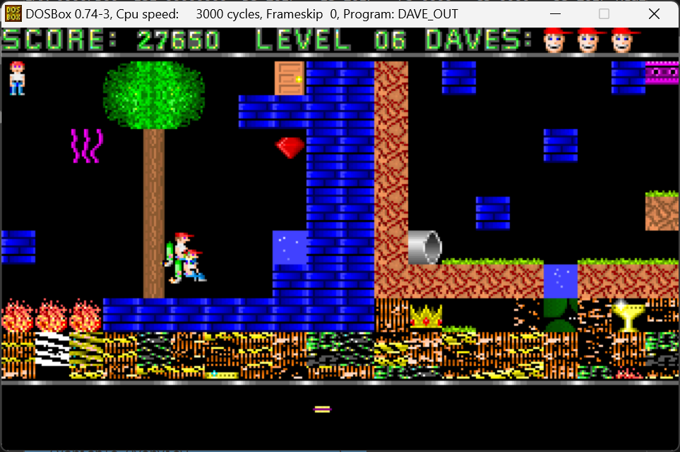
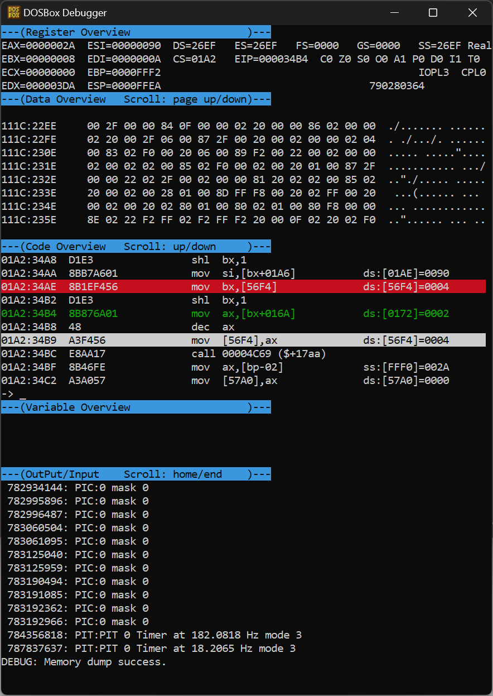
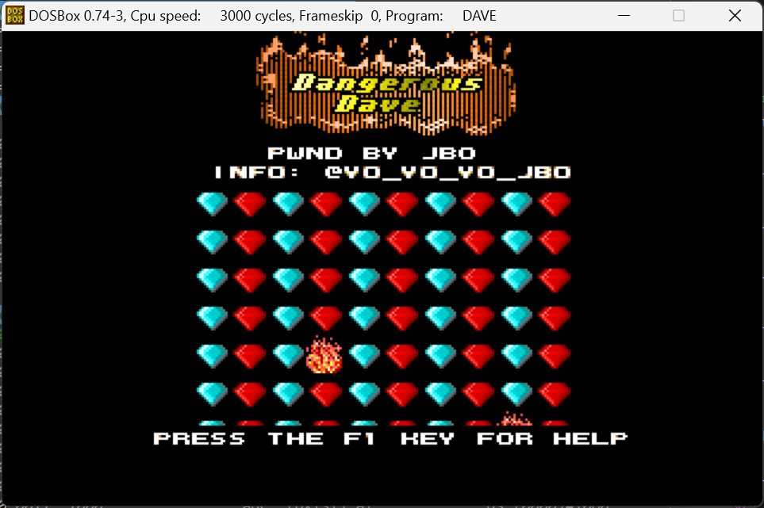

# A very Dangerous Dave
This is an unusual blogpost about a bug (vulnerability?) that has been bothering me for years.  
When I was a kid I used to play tons of old DOS games. [Commander Keen](https://en.wikipedia.org/wiki/Commander_Keen)? With pleasure! [SkyRoads](https://en.wikipedia.org/wiki/SkyRoads_(video_game))? I remember most stages by heart. [AlleyCat](https://en.wikipedia.org/wiki/Alley_Cat_(video_game))? Oh yes!  
Well, one of the most remembered games from that era is [Dangerous Dave](https://en.wikipedia.org/wiki/Dangerous_Dave).  
You see, Dangerous Dave was a platformer - it had 10 levels, each one had a goal of getting to a trophy and passing through a door.  
Some of these levels had `Warp Zones` which are "secret levels", and you get to them by going out-of-bounds.  
Being an inquisitive young boy, I tried to find all warp zones, and I accidently found an unexpected one in level 6, which caused an unexpected behavior.  
You can click the link to watch a video recording of that:  

[](http://www.youtube.com/watch?v=95tPM7GGAeI "Dave OOBR")

The end result looks like a complete mess:


The idea of level 6 was to go right, take the trophy, head back and touch the door, however, *the door is treated as empty space if you still do not have the trophy*.  
I believe this was an obvious [out-of-bounds-read](https://cwe.mitre.org/data/definitions/125.html), but as a kid I never investigated it further.  
MANY years went by, until I finally found some spare time to try and understand what happens there.  
That led me to an interesting rabbit hole that I'd like to share today!

## LZEXE
The game comes packed in one file only - `DAVE.EXE` (sha1 = `b0e70846c31d651b53c2f5490f516d8fd4844ed7`), its size is merely 76597 bytes!  
I was hoping to see many strings, but didn't see any. Opening it in IDA revealed it might be packed... I noticed it resolves some interrupt handlers from the interrupt handler table and even hooks the "divide by zero" handler (I talked about the subject [in the past](https://github.com/yo-yo-yo-jbo/mbr_analysis/)).  
It was later clear to me the code was compressed, and while I could have worked my way through it, I decided to search online.  
That led me to a thriving modding community - [shikadi.net](https://moddingwiki.shikadi.net/wiki/Dangerous_Dave) (if you don't know what a "Shikadi" is, you should play more [Commander Keen](https://en.wikipedia.org/wiki/Commander_Keen)). They had very complete records of the file format(s) and even a link to one Ghidra project file with some important notes. I can honestly say it saved me tons of work, and that's an important lesson too - it's cheaper to search online rather than embark on heavy reverse-engineering on your own.  
One of the first things I discovered was the file is [LZW-compressed](https://moddingwiki.shikadi.net/wiki/UNLZEXE), and luckily the community has a tool to decompress the executable:

```shell
UNLZEXE.EXE DAVE.EXE
```
This makes the file 172848 bytes long - more than double in size!

## File format and tilemap
The next part was to examine the file format and the level information.  
As before, the modding community left very [complete notes](https://moddingwiki.shikadi.net/wiki/Dangerous_Dave) with offsets in the file of where certain things are, including tilesets, level information and so on.  
While I was mostly interested in the level information, I wanted to examine the tile data - level data references tile numbers.  
Luckily, a modder called [MaiZure](https://www.maizure.org/projects/index.html) had a project that was kind of easy to compile and run to extract the tile information - thank you so much for that!  
While the tools MaiZure built are great, I ended up building my own parser in Python, which adds a few missing pieces.


With greater confidence, I approached the format of the levels, which was the most interesting to me.

## Level formats
The level format is described well in the modding wiki. There are `10` levels - each one is `100x10` tiles. Additionally, there is one special level with only tile information, which represents the tiles that appear in the opening screen (it's `10x7` tiles).  
The normal levels appear in an array of `1280 bytes` per element, each containing:
1. Path data (`256 bytes`) - data about paths that monsters can take. While interesting, not relevant to our scope.
2. Tiles (`1000 bytes`) - the `100x10` level information, each byte references a tile.
3. Padding (`24 bytes`) - unused.

There is another place where the initial state for each level is saved (again in a `10`-element array), which includes the `starting X position`, `starting Y position` and the `initial motion` (which can be `stationary` or `falling`).

It's interesting to see that levels contain the `warp zones` tiles in them, they are not special levels at all!  
The metadata for `warp zones` is saved in a different offset in the file, alongside two constants that are shared for all warp zones:
1. `The starting Y position for warp zones` is constant. That makes sense since all warp zones display an animation of Dave falling in a some sort of "tube".
2. `The motion flags for warp zones` is constant. That motion flag has realistically two options: `falling` and `stationary`. Since Dave is `falling` in all warp zones, it's a global variable.
3. `Starting X coordinate` for each warp level is saved in an array of `10` elements.
4. `Horizontal shift` for each level is saved in an array of `10` elements.

The `horizontal shift` works with the `starting X coordinate` to position Dave at the right position in the `warp zone.`  
It's interesting to note that there are only `4 warp zones` - in levels `5`, `8`, `9` and `10`. All other levels have all those other values as `0`.  
At that point I wanted to take a better look and coded my own parser, which I uploaded to this repository.
It expects the unpacked `DAVE.EXE` and parses it. I believe I found some slight errors in the modding community descriptions (for example, the `warp zone` X coordinate is in tiles and the horizontal shift is in pixels), but I was able to work around them.  

```
./dave_parse.py

...

Level 8 (start at (2, 8) stationary):

X-------------|-----------------|#  ################################################################
X             |  *            J |          $  $      W    W            *         T                ##
X            Q|      --         |                                                           OOO  ###
X #    #------|G  --    -     - #########        ###   W    W       =         =             OOO ####
X             |            -            ####oo####XXXXXXXXXX\W                               |   $##
X    #   #    |                   *        ####XXX/     \XXXX\W ======       =======         |    ##
X       _     |*    XXX  -    -  XXX*                    MX&JXW         *                    |    ##
X  #    X     X   XX/              XX * *                 X  XXXX     #     #        $   #   |    ##
X>___ ____   ___ _XX                XXXXX* * *    W     JXXX                                 |   ###
XXXXXoXXXXoooXXXoXXXWWWWWWWWWWWWWW  WXXXXXXXXXXXXXXXXXXXXXXXXX####WWWWW#####WWWWW######WWWWW########


Loaded 11 levels.
Choose a level to view (zero-based) or 'Q' to quit: q
Quitting.
```
(yes, that thing on the right is a tree)

## Transitioning to warp levels
Figuring out the variable that maintains the current level number was pretty easy. I was looking at the strings and found the following:

```
         congratulations!
you made it through all the peril-
ous areas in clyde's hideout!
very good work! did you find
the 4 warp zones? they are located
on levels 5,8,9 and 10. just jump
off the top of the screen at the
extreme left or right edge of the
world and voila! you're there!
```

Looking at references for those strings in IDA was easy too after some minor prettifying:
```c
PresentFreeText("         congratulations!");
PresentFreeText("you made it through all the peril-");
PresentFreeText("ous areas in clyde's hideout!");
PresentFreeText("very good work! did you find");
PresentFreeText("the 4 warp zones? they are located");
PresentFreeText("on levels 5,8,9 and 10. just jump");
PresentFreeText("off the top of the screen at the");
PresentFreeText("extreme left or right edge of the");
PresentFreeText("world and voila! you're there!");
```

Of course, this is a further testament that level 6 should not have a `warp zone`...  
But most importantly, it gave me the function that runs when a level is completed. Quickly I found this:

```c
    sub_1749B();
    word_56F4 = word_56F4 + 1;
    sub_10BFB();
    if (word_573C == 1) {
      word_573C = 0;
      word_56F4 = word_6152;
    }
    if ((int)word_56F4 < 10) {
      sub_10BFB();
      sub_14C69();
      sub_17631();
      sub_18CDA();
      sub_14B9C();
      sub_13235();
    }
```

- The comparison to `10` and its increament clearly indicated that `word_56F4` is the current level number.
- Following the code flow a bit, `word_573C` seems to maintain whether we're in a warp zone or not!
- Note that if we just finished a warp zone (`word_573C == 1`) then the current level is restored - `word_56F4 = word_6152`. This means `word_6152` saves the level Dave should warp back into. That makes sense because after level 5, for instance, Dave warps to the warp zone at level 2, so level 5 is going to be saved in that memory address.

At this point I decided to validate all these learnings. While it was my first time of using [the DosBox debugger](https://www.dosbox.com), I must say it was very intuitive and surprisigly efficient!
  

From that point reverse-engineering became easier - I had to look for *assignments* to `word_6152` (the level backup). That should happen when moving to warp zones, and luckily there was only one such writing reference:

```c
g_curr_warp_zone_mapping = g_current_level;
var2 = *(word *)(g_current_level * 2 + 0x192);
var3 = *(word *)(g_current_level * 2 + 0x1a6);
g_current_level = *(int *)(g_current_level * 2 + 0x16a) - 1;
sub_14C69();
g_start_y = 0x10;
```

- Here we can see how the current level is backed-up for coming back from the warp zone.
- The current level number is mapped from `0x16A + (2*current_level)-1`.
- Perhaps not surprisingly, `g_start_y = 0x10` is the constant they mention at the modding community for the warp zone starting Y position. When I originally read the description, I assumed this was in a data segment, but it's just a constant baked into the code (probably originally in a `#define`).

The calculation for loading the current level is loaded from address `0x2583a` (plus twice the current level, minus one). Indeed we can see this easily:

```python
import struct
struct.unpack('<10H', open('DAVE.EXE', 'rb').read()[0x2583a:0x2583a+20])
```

This yields `(0, 0, 0, 0, 2, 0, 0, 6, 7, 1)` - we can clearly see the warp zones at 1-based indexes 5, 8, 9 and 10. Success!

## Level 6
When level `5`, for example, is loaded, `2` is returned, and the tiles from that level are processed, which are really element `1` in the 0-based levels array.  
Thanks to the modding community, we already know the tiles start at offset `0x26E0A` (with each element being `0x500` bytes long).  
Well, let's imagine what happens to level `6`... The returned number is `0`, which will be index `-1`, which is really `0xFFFF`...
Interestingly, that `sub_14C69` seems to be exactly the level loader:

```c
Starty = *(word *)(g_current_level * 2 + 0x136);
...
src = word3687C + g_current_level * 0x500;
```

Well, that multipication by `0x500` is a clear indication that the base address (loaded from `word3687C`) should be the base of the levels.  
Indeed by debugging I see it maps back to the file offset `0x26E0A`. So, marking `0x26E0A` as `g_levels` and with each element taking `0x500` bytes, we simply get:

```c
src = g_levels[g_current_level];
```

Well, if `g_current_level` is `0xFFFF` then multiplying it by `0x500` gives `0xFB00` because of the 16-bit wrap-around:

```python
hex((0xFFFF * 0x500) & 0xFFFF)
```

Therefore, the warp-level tiles for level 6 are loaded from address `0x2932B`, and indeed:

```python
import binascii
print(binascii.hexlify(open('DAVE.EXE', 'rb').read()[0x2932B:0x2932B+0x20], ' '))
```

This yields `00 00 00 2b 23 2c 00 00 02 05 05 01 00 05 00 00 00 00 05 1e 1e 1e 1f 1e 1e 1d 14 00 00 1f 1e 00` which corresponds to the buggy tiles we see.

By the way, I've added the buggy level representation to the parser I coded, here's how it looks like:

```
Buggy warp level:

##XXX/     \XXXX\W ======       =======         |    ##X       _     |*    XXX  -    -  XXX*
            MX&JXW         *                    |    ##X  #    X     X   XX/              XX * *
             X  XXXX     #     #        $   #   |    ##X>___ ____   ___ _XX                XXXXX* *
*    W     JXXX                                 |   ###XXXXXoXXXXoooXXXoXXXWWWWWWWWWWWWWW  WXXXXXXXX
XXXXXXXXXXXXXXXXX####WWWWW#####WWWWW######WWWWW########?M_ ? ?T? ??? Xg]??M| W WXW?W#W?W#W?W#W????=?
??#???#??? ?? 3???????? ????? ???? ??????????  ?????????????????????????????????????????????????????
?????????????? ?????????????????????????????????????????????????????????? ????????????? L?O ? ?_!?
   WWW|||----g     ??????????????LT|-----V------------------V---------------------
   $        |                      |*        *       M                 Q       $$       $        -
            |                      |                         *    *        $   --
```

See all the `?` symbols? Those are out-of-bounds tiles (which explains the weird buggy-looking tiles at the bottom of that level).

## Further mysteries
After the blogpost was published, I got some follow-up questions:
- Apparently, if you go out-of-bounds on the *right* side of the screen in level 6, you get to the `warp zone` from level 8. Why does that happen?
- If you get a score bigger than `99,999`, pressing `ESC` to go to the menu increases your life every time you pick something up. Neat!

Well, the first one is easy - since the `warp zone` from level 8 is "combined" into level 6, the out-of-bounds simply loads the right side of the level, so you never truly stepped into a `warp zone`.
The 2nd question requires further explanation. Armed with all the knowledge I had, I found an initialization function at offset `0x535a` from the file. Some parts of it made it quite clear (with some simple variable renaming):

```c
g_lives = 3;
g_score_lo = 0;
g_score_hi = 0;
g_next_goal = 0;
g_unknown4 = 0;
g_is_game_over = 0;
g_current_level = 0;
g_some_level_reference = 0;
g_maybe_levels_left = 10;
g_is_warp_zone = 0;
```

Debugging with the the DosBox debugger helped clarify everything and helped me a lot with the renaming.  
The score is composed of an entire `32`-bit value (implemented as two halves - each `16` bit).  
Now that I know where the number of lives is saved, reverse-engineering is pretty quick - I suspected there is no memory corruption issue this time but just a logic bug, perhaps.  
The conditions that increases the number of lives are:
1. The difference between the current score and the "next goal" is more than `0x4e20` (which is `20000` points).
2. The current number of lives is less than `3`.
3. <TBC?>

## Summary
Of course that after all of that I had to add some funny changes, my parser is also capable of editing levels and text:


This has been an unusual weekend project for me, I am very grateful for the [shikadi.net](https://moddingwiki.shikadi.net/wiki/Dangerous_Dave) modding community.  
Even though this kind of reverse-engineering is less and less common in real world scenario, I still think it's interesting.  
I appreciate old DOS games and how they cleverly implemented games in so little disk storage space and memory space - I see that as a lost art!

Thank you,

Jonathan Bar Or
